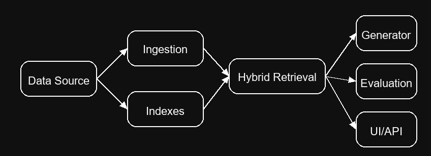

# Multimodal RAG System


A production-ready, multimodal retrieval-augmented generation (RAG) platform that indexes documents, images, and tables; performs hybrid dense + sparse retrieval with re-ranking; enforces inline citations; and ships with a Streamlit UI, FastAPI service, evaluation harness, and Docker deployment workflow.



## Key Capabilities

- Multi-modal ingestion for text (PDF/HTML/MD/TXT), images (PNG/JPG), and structured tables (CSV/Parquet via DuckDB).
- Hybrid retrieval pipeline blending FAISS dense search, Whoosh BM25, CLIP image bridging, and rule-based DuckDB SQL queries, fused with reciprocal rank fusion and cross-encoder re-ranking.
- Grounded answer generation with strict `[source_i]` citation enforcement and optional OpenAI backend (local template summarizer by default).
- Streamlit UI with image upload, evidence panels, latency readouts, and one-click evaluation.
- Evaluation harness (ragas-style) producing faithfulness, relevancy, context precision/recall, and adversarial citation checks.
- End-to-end automation via Makefile, Docker Compose, GitHub Actions CI, and pre-commit hooks.

## Quickstart

### Bare Metal

```bash
python -m venv .venv
source .venv/bin/activate  # Windows: .venv\Scripts\activate
make setup
make index
make api     # FastAPI → http://localhost:8000/docs
make ui      # Streamlit → http://localhost:8501
```

Optional: set `OPENAI_API_KEY` in `.env` to enable the OpenAI generator backend.

### Docker Compose

```bash
docker-compose up --build
```

Services:
- `api`: FastAPI + Uvicorn on port 8000
- `ui`: Streamlit front-end on port 8501

Stop with `docker-compose down`.

## Make Targets

| Target | Description |
| --- | --- |
| `make setup` | Install runtime + dev dependencies and pre-commit hooks |
| `make index` | Rebuild FAISS, BM25, and DuckDB catalogs from `/data` |
| `make api` | Launch FastAPI with auto-reload |
| `make ui` | Launch Streamlit UI |
| `make eval` | Run evaluation → `docs/eval_report.md` + radar chart |
| `make test` | Run pytest, mypy, and ruff |
| `make lint` | Ruff + mypy |

## API Examples

### Query (curl)

```bash
curl -X POST http://localhost:8000/query \
  -H "Content-Type: application/json" \
  -d '{"query_text": "How did sustainability metrics change in 2024?", "top_k": 5}'
```

### Query (Python)

```python
import requests

payload = {"query_text": "Show me Q3 revenue", "top_k": 4}
response = requests.post("http://localhost:8000/query", json=payload, timeout=30)
response.raise_for_status()
print(response.json()["answer"])
```

### Reindex Dataset

```bash
curl -X POST http://localhost:8000/index -H "Content-Type: application/json" -d '{"data_root": "data"}'
```

### Streamlit Preview


## Architecture Notes

- **Chunking**: Text documents are tokenized with lightweight word splitting into ~220-token overlapping chunks (configurable). Metadata tracks source path, offsets, and modality.
- **Hybrid Retrieval**:
  - Dense: SentenceTransformer embeddings stored in FAISS (with `.npy` fallback).
  - Sparse: Whoosh BM25 for keyword coverage.
  - Image: CLIP embeddings + average-pixel fallback to bridge uploaded images to indexed assets.
  - Tables: DuckDB-registered CSV/Parquet tables with generated "table cards" plus heuristic SQL synthesis for snippets.
  - Reciprocal Rank Fusion merges candidate lists before cross-encoder re-ranking (`ms-marco-MiniLM-L-6-v2`).
- **Generation**: Local template summarizer ensures deterministic answers with inline citations; optional OpenAI backend if credentials are available. A citation guard validates each sentence.
- **Evaluation**: Mini dataset spanning text, image, and table evidence. RAGAS metrics plus adversarial citation checks produce `docs/eval_report.md` and `docs/eval_radar.png`.

## Evaluation Snapshot

Run `make eval` after indexing to refresh scores.

| Metric | Score |
| --- | --- |
| Faithfulness | TBD |
| Answer Relevancy | TBD |
| Context Precision | TBD |
| Context Recall | TBD |

Full report: [`docs/eval_report.md`](docs/eval_report.md)

## Sample Data

- `/data/docs/`: company overview markdown, sustainability HTML, and a minimal PDF (`aurora_brief.pdf`).
- `/data/images/`: synthetic PNG assets illustrating product shots and charts.
- `/data/tables/`: CSV & Parquet tables (`products.csv`, `revenue_by_quarter.csv`, `installations.parquet`).

All assets are synthetic for demo purposes; no external licenses required.

## Limitations & Next Steps

- OCR fallback is stubbed; integrate pytesseract or cloud OCR for scanned PDFs.
- Table SQL synthesis is rule-based; consider semantic parsers (e.g., PICARD) for complex queries.
- Multilingual support limited to English embeddings.
- Model downloads happen on first run; add offline caching or container layers for air-gapped environments.
- Optional enhancements: BLIP captioning for images, sparse query rewriting, PDF thumbnail previews in UI.

## Contributing

See [CONTRIBUTING.md](CONTRIBUTING.md) and [CODE_OF_CONDUCT.md](CODE_OF_CONDUCT.md). We use `area:*`, `kind:*`, and `priority:*` labels in issues and milestones M0–M7 for roadmap tracking.

---

Released under the [MIT License](LICENSE).
